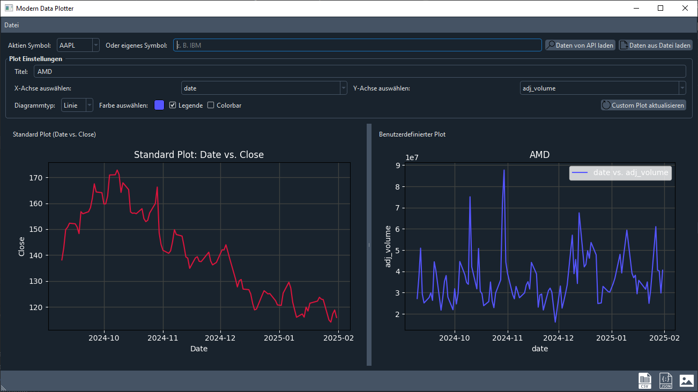
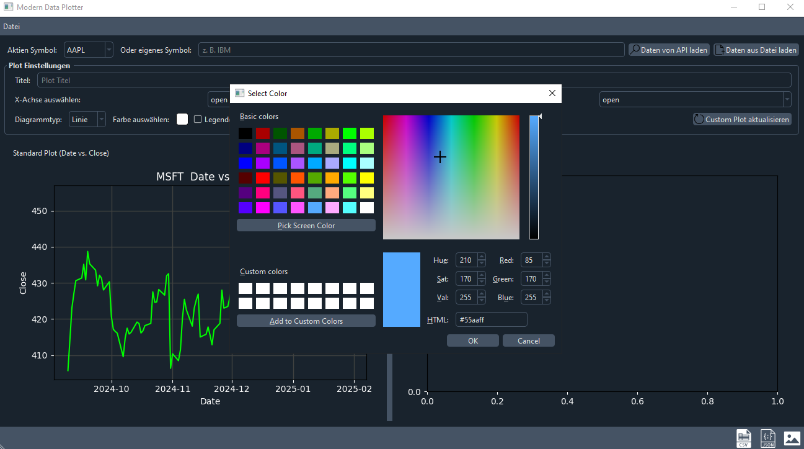

# Marketstack Plotter

Ein erweitertes Plotter-Programm, welches Finanzdaten entweder über die Marketstack-API oder aus einer lokalen
JSON-/CSV-Datei lädt und diese in zwei verschiedenen Plot-Bereichen visualisiert.


## Inhaltsverzeichnis

- [Über die App](#über-die-app)
- [Features](#features)
- [Installation](#installation)
- [Benutzung](#benutzung)
- [Screenshots](#screenshots)


## Über die App

Der **Modern Data Plotter** bietet zwei verschiedene Plotbereiche:

- **Standard-Plot:** Visualisiert den Standardverlauf von `date` gegen `close`.
- **Benutzerdefinierter Plot:** Hier können Benutzer individuell aus den geladenen Daten die x- und y-Achse wählen sowie
  weitere Plot-Einstellungen wie Titel, Achsenbeschriftungen, Diagrammtyp, Farbe, Legende und Colorbar festlegen.

Zudem können die geladenen Daten als JSON oder CSV gespeichert werden. Über die benutzerfreundliche Oberfläche lassen
sich zudem Daten über die Marketstack-API abrufen oder lokal aus Dateien laden.


## Features

- **📃 Datenquelle:**
    - Laden von Finanzdaten über die Marketstack-API.
    - Laden von lokalen JSON- oder CSV-Dateien.
- **📈 Ploting📊:**
    - Standardplot: `date` vs. `close`.
    - Benutzerdefinierter Plot mit frei wählbaren Achsen.
    - Unterstützung von Liniendiagrammen, Scatter-Plots und Balkendiagrammen.
- **⌨ UI-Elemente:**
    - Dropdown-Menü für die 30 gängigsten Aktien-Symbole.
    - Textfeld zur Eingabe eigener Aktien-Symbole.
    - Farbauswahl, Legenden- und Colorbar-Option.
    - Menü- und Toolbar-Elemente mit Icons.
- **🖨 Datenexport:**
    - Speichern des Plots als Bild (PNG/JPEG).
    - Export der Daten als JSON oder CSV.
- **🌙 Modernes Design:**
    - Verwendung des `qdarkstyle`-Themes für ein modernes, dunkles Interface.


## Installation

<details><summary>Empfolen ist eine venv (virtual environment) zu erstellen. Klicke hier um mehr zu erfahren:</summary>

```bash
python -m venv market-plotter
```

### venv aktivieren:

#### Windows:

```
.market-plotter\Scripts\activate
```

#### Linux/macOS:

```bash
source market-plotter/bin/activate
```

<details><summary>deaktivieren von virtual environment</summary>
```bash
deactivate
```
</details>

<details><summary>entfernen der virtual environment:</summary>

##### Windows:

```bash
rmdir /S /Q market-plotter
```

#### Linux/macOS:

```bash
rm -rf market-plotter
```

</details>

<details><summary>virtual environment umbenennen:</summary>

#### First, deactivate if active

```bash
deactivate
```

#### Windows (CMD):

```bash
 ren market-plotter new_name
```

#### Linux/macOS:

```bash
  mv market-plotter new_name
```

#### Nach dem Umbenennen, überprüfe und aktualisiere absolute Pfade in den Aktivierungsskripten, falls notwendig.

</details>
</details>


Stelle sicher, dass Python 3 installiert ist. Anschließend können die benötigten Pakete via `pip` installiert werden:

```bash
pip install PySide6 matplotlib qdarkstyle pandas requests
```

Alternativ kann auch das `requirements.txt`-File genutzt werden:

```bash
pip install -r requirements.txt
```

<details><summary>Falls gewünscht, kann das Programm auch als ausführbare Datei <code>exe</code> für Windows-Systeme erstellt werden. Hierfür wird
das Paket <code>pyinstaller</code> benötigt:</summary>

```bash
pip install pyinstaller
```

Anschließend kann das Programm mit folgendem Befehl kompiliert werden:

```bash
pyinstaller --onefile --windowed --icon=icon.ico MarketDataAPIv3.py
```

</details>


## Benutzung

❗ Vor der Programmstart sollte ein [marketstack.com](https://marketstack.com) Key in den `.env` hinzugefügt werden.

Das Programm kann über die Kommandozeile gestartet werden:

```bash
python MarketDataAPIv3.py
```

Nach dem Start des Programms kann entweder ein Aktien-Symbol aus dem Dropdown-Menü ausgewählt oder ein eigenes Symbol
eingegeben werden. Anschließend kann entweder über die API oder über eine lokale Datei die Daten geladen werden.

Custom-Plot-Optionen können über die GUI eingestellt werden. Der Plot kann als Bild gespeichert oder die Daten
exportiert
werden.


## Screenshots

<details> <summary>UI PySide6</summary>



</details>


## Quellen

- [SVGREPO](https://www.svgrepo.com/collections/)
- [Marketstack](https://marketstack.com/)

