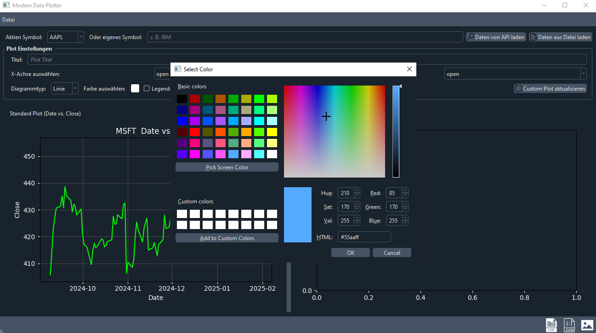

# Marketstack Plotter

An advanced plotter program that loads financial data either via the Marketstack API or from a local JSON/CSV file and visualizes them in two different plot areas.

## Table of Contents

- [About the App](#about-the-app)
- [Features](#features)
- [Installation](#installation)
- [Usage](#usage)
- [Screenshots](#screenshots)

## About the App

The **Modern Data Plotter** offers two different plot areas:

- **Standard Plot:** Visualizes the default progression of `date` against `close`.
- **Custom Plot:** Users can individually select the x- and y-axis from the loaded data and set additional plot settings such as title, axis labels, chart type, color, legend, and color bar.

Additionally, the loaded data can be saved as JSON or CSV. The user-friendly interface also allows fetching data via the Marketstack API or loading from local files.

## Features

- **📃 Data Source:**
    - Load financial data via the Marketstack API.
    - Load local JSON or CSV files.
- **📈 Plotting 📊:**
    - Standard plot: `date` vs. `close`.
    - Custom plot with freely selectable axes.
    - Support for line charts, scatter plots, and bar charts.
- **⌨ UI Elements:**
    - Dropdown menu for the 30 most common stock symbols.
    - Text field for entering custom stock symbols.
    - Color selection, legend, and color bar options.
    - Menu and toolbar elements with icons.
- **🖨 Data Export:**
    - Save the plot as an image (PNG/JPEG).
    - Export data as JSON or CSV.
- **🌙 Modern Design:**
    - Uses the `qdarkstyle` theme for a modern, dark interface.

## Installation

<details><summary>It is recommended to create a virtual environment (venv). Click here to learn more:</summary>

```bash
python -m venv market-plotter
```

### Activate venv:

#### Windows:

```
.market-plotter\Scripts\activate
```

#### Linux/macOS:

```bash
source market-plotter/bin/activate
```

<details><summary>Deactivate virtual environment</summary>

```bash
deactivate
```
</details>

<details><summary>Remove virtual environment:</summary>

##### Windows:

```bash
rmdir /S /Q market-plotter
```

#### Linux/macOS:

```bash
rm -rf market-plotter
```

</details>

<details><summary>Rename virtual environment:</summary>

#### First, deactivate if active

```bash
deactivate
```

#### Windows (CMD):

```bash
 ren market-plotter new_name
```

#### Linux/macOS:

```bash
  mv market-plotter new_name
```

#### After renaming, verify and update absolute paths in activation scripts if necessary.

</details>
</details>

Ensure that Python 3 is installed. Then install the required packages via `pip`:

```bash
pip install PySide6 matplotlib qdarkstyle pandas requests
```

Alternatively, you can use the `requirements.txt` file:

```bash
pip install -r requirements.txt
```

<details><summary>If desired, the program can also be compiled into an executable <code>exe</code> file for Windows systems. The <code>pyinstaller</code> package is required for this:</summary>

```bash
pip install pyinstaller
```

Then compile the program with the following command:

```bash
pyinstaller --onefile --windowed --icon=icon.ico MarketDataAPIv3.py
```

</details>

## Usage

❗ Before starting the program, a [marketstack.com](https://marketstack.com) key should be added to the `.env` file.

Start the program via the command line:

```bash
python MarketDataAPIv3.py
```

After launching the program, a stock symbol can be selected from the dropdown menu or a custom symbol can be entered. Data can then be loaded either via the API or from a local file.

Custom plot options can be configured via the GUI. The plot can be saved as an image, and the data can be exported.

## Screenshots

<details> <summary>UI PySide6</summary>



</details>

## Sources

- [SVGREPO](https://www.svgrepo.com/collections/)
- [Marketstack](https://marketstack.com/)

